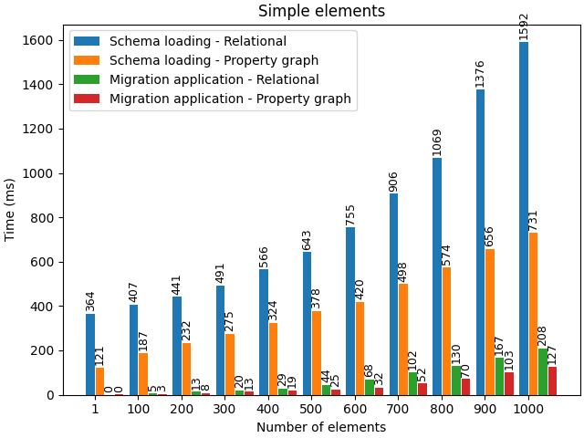
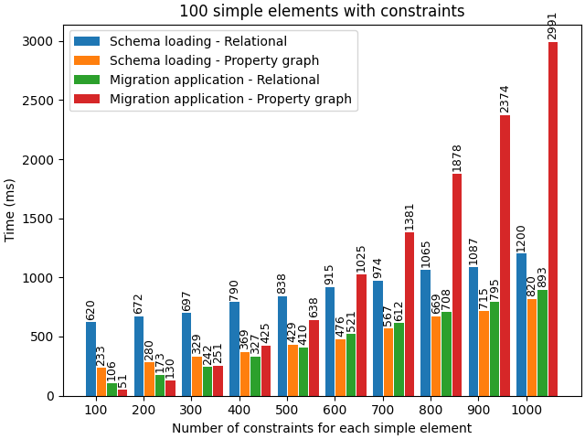
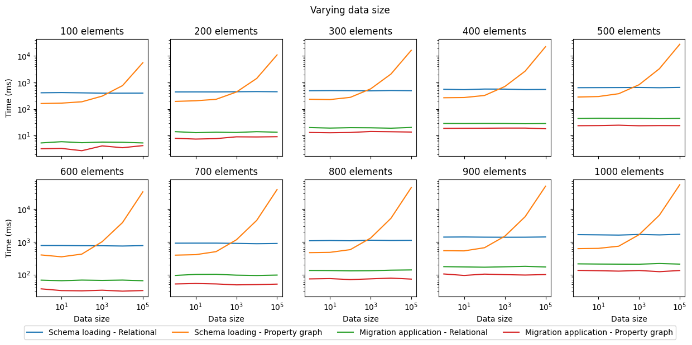

# Evaluation of the execution time

This experiment connects to a PostgreSQL database and to a Neo4j database to extract schemas, and to apply a template migration. The execution time for loading each schema and for applying on it the migration are measured.

## Conditions
In a first experiment, schemas are created with a varying number of simple elements (i.e., tables for relational schemas and nodes for property graph schemas) from 1 to 1~000 by steps of 100 elements. Each element has only 5 simple attributes (no primary, foreign keys or edges), for which there will be no constraint preservation or creation to verify.

In a second experiment, we create schemas with 100 simple elements (i.e., tables and nodes), some attributes (20 for the relational schema and 5 for the property graph schema), and a varying number of constraints: 
- 1 primary key and a varying number of foreign keys (from 1 to 10 with steps of 1 for each table, thus from 100 to 1~000 with steps of 100 for the whole schema) for the relational schemas;
- a varying number of edges (from 100 to 1~000 with steps of 100, dispatched among the nodes) for the property graph schemas. 
Thus, in each relational schema there is one constraint for the primary key and one constraint for each foreign key. As constraint of the edge in the property graph model is mapped during the migration, the verification of the need to create this constraint will also be triggered. 
In each property graph schema there is one constraint for each edge. As contraint of the foreign key in the relational model is mapped during the migration, the verification of the need to create this complex constraint will also be triggered. 

In a third experiment, schemas are created identically to the first experiment, but the number of instances (i.e., tuples and nodes having a defined label) for each element varies from 1 to 100~000, by multiplying by 10 at each step. It allows to see the impact of the volume of data on execution time. 

## Results

### Simple elements
When there is no contraints in the schema, the migration application time slowly increases depending on the number of elements in the schema, but remains low (up to 200ms for 1~000 elements). The schema extraction time also increases with more elements in the schema. 


### Elements with constraints
When adding constraints, the migration application time depends mainly on the migration mapping: if there is a complex constraint to verify in the destination model (such as the migration from the property graph schema towards the relational model that maps edges to foreign keys), the execution time is more impacted than when the destination constraint is less complex (such as the migration from the relational schema towards the property graph model that maps foreign keys to edges). 


### Varying data volume
When varying data volume, the migration time remains stable. However, the schema extraction time can be impacted depending on the DBMS from which data are extracted. PostgreSQL keeps track of the schema, thus the schema extraction time does not depend on the data volume. Neo4j infers the schema from available data, thus the schema extraction time depends on the data volume. 


## Versions used
- Java 17.0.10
- Scala 3.3.3
- PostgreSQL 14.12
- Neo4j 5.25.1

## PostgreSQL experiment setup
To run the experiment, in the `benchmark_init_postgres.sh` and in the `benchmark_execution_postgres.scala` files, replace the pgUser, pgPassword and pgBase variables to fit the database you wish to use.

Then, firt run the setup script with:
```bash
. ./benchmark_init_postgres.sh
```

and run the benchmark execution script with:
```bash
scala -classpath CDMiA-DataWrapper-0.2.0.jar:postgresql-42.7.3.jar benchmark_execution_postgres.scala
```

## Neo4j experiment setup
To run the experiment, in the `benchmark_init_neo4j.sh` and in the `benchmark_execution_neo4j.scala` files, replace the neo4jFolder, user and password variables to fit the database you wish to use.

Then, firt run the setup script with:
```bash
. ./benchmark_init_neo4j.sh
```

and run the benchmark execution script with:
```bash
scala -classpath neo4j-jdbc-driver-5.25.0.jar:CDMiA-DataWrapper-0.2.0.jar benchmark_execution_neo4j.scala
```


