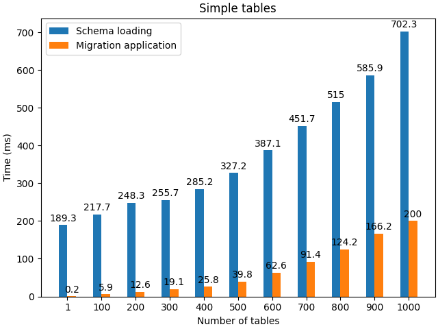
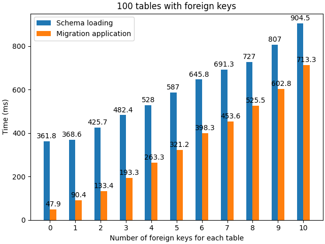

# Evaluation of the execution time

This experiment connects to a PostgreSQL databse to extract schemas, and to apply a template migration. The execution time for loading each schema and for applying on it the migration are measured.

To run the experiment, in the `benchmark_init_postgres.sh` and in the `benchmark_execution_postgres.scala` files, replace the pgUser, pgPassword and pgBase variables to fit the database you wish to use.

Then, firt run the setup script with:
```bash
. ./benchmark_init_postgres.sh
```

and run the benchmark execution script with:
```bash
scala -classpath CDMiA-DataWrapper-0.2.0.jar:postgresql-42.7.3.jar benchmark_execution_postgres.scala
```

In a first experiment, schemas are created with a varying number of tables (from 1 to 1~000) having only 5 simple attributes (no primary or foreign keys), for which there will be no constraint preservation or creation to verify.

In a second experiment, we create schemas with 100 tables, 20 attributes, 1 primary key and a varying number of foreign keys (from 1 to 10). Thus, in each schema there is one constraint for the primary key and one constraint for each foreign key. As constraintt of the edge in the property graph model is mapped, the verification of the need to create this constraint will also be triggered.




